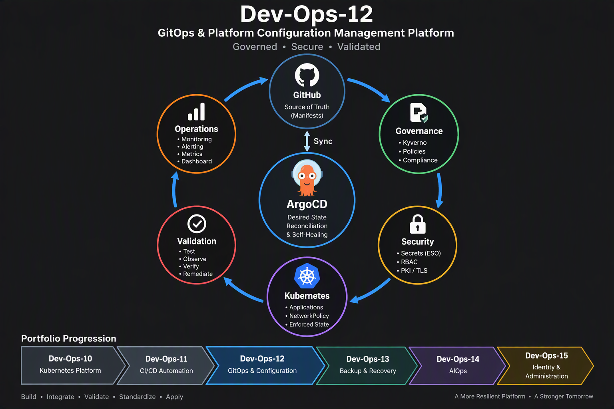
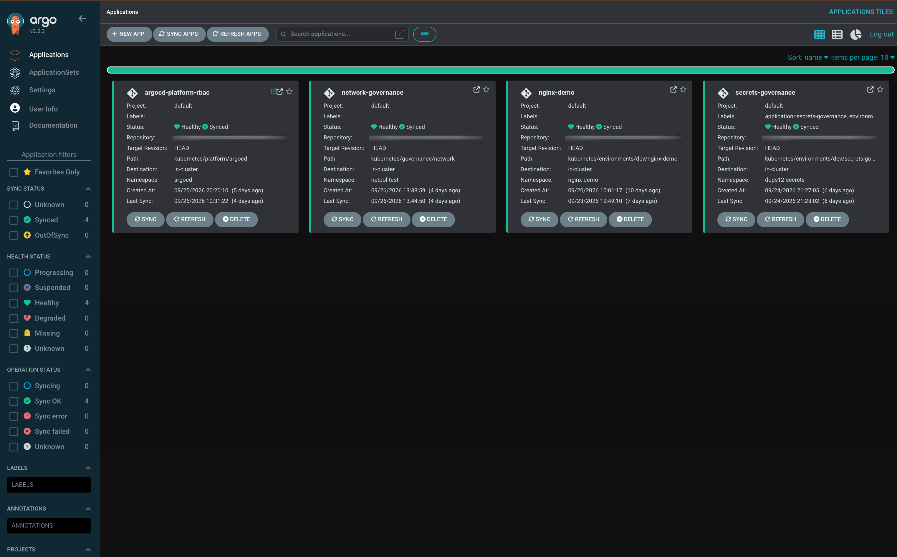
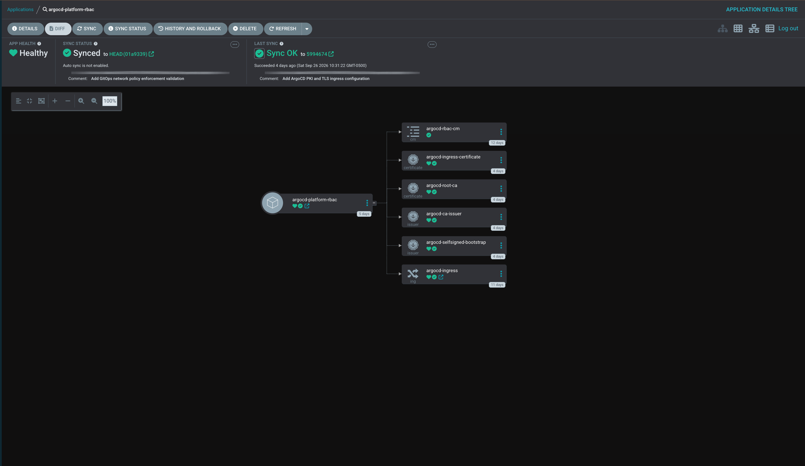
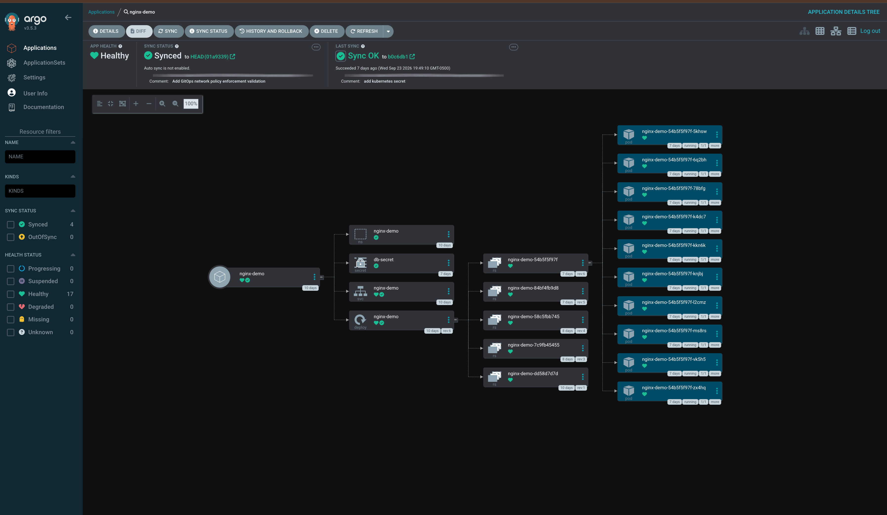
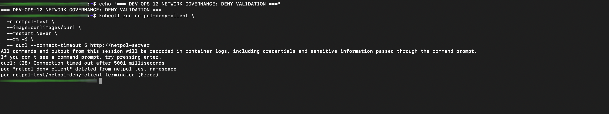
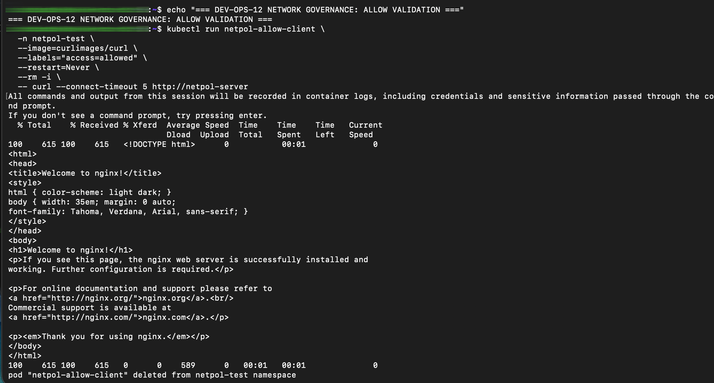

# Dev-Ops-12 GitOps & Platform Configuration Management Platform




## Overview

Dev-Ops-12 implements a GitOps operating model for Kubernetes using ArgoCD.

The platform establishes Git as the authoritative source of truth for Kubernetes platform services and applications. Desired state is continuously reconciled through ArgoCD, enabling automated deployments, drift detection, self-healing, rollback capability, operational visibility, and configuration governance.

This project extends the Kubernetes platform created in Dev-Ops-10 and the CI/CD delivery capabilities implemented in Dev-Ops-11.

---

## Portfolio Relationship

```text
Dev-Ops-10
Kubernetes Platform Engineering & Operations Platform
|
v
Dev-Ops-11
Source Control & Modernized Delivery Automation Platform
|
v
Dev-Ops-12
GitOps & Platform Configuration Management Platform
|
v
Dev-Ops-13
Backup & Platform Recovery Platform
|
v
Dev-Ops-14
AIOps Platform
|
v
Dev-Ops-15
Enterprise Identity & Administration Platform
```

---

## Project Origin

Dev-Ops-10 established the Kubernetes platform foundation including cluster services, ingress, storage, monitoring, authentication, and platform operations.

Dev-Ops-11 introduced source control, GitHub Actions, container image management, and modern CI/CD delivery workflows for Kubernetes workloads.

Dev-Ops-12 extends that foundation by establishing Git as the source of truth and ArgoCD as the reconciliation engine for governed desired state. The platform was used to design, integrate, test, and behaviorally validate governance, secrets management, least-privilege authorization, private PKI and trusted TLS, and Kubernetes network controls.

The implementation followed an iterative engineering approach:

```text
Design
|
v
Implement
|
v
Test
|
v
Observe
|
v
Correct
|
v
Retest
|
v
Validate
|
v
Standardize
```

The resulting patterns establish a known-good configuration and governance foundation for subsequent operational platforms.

Dev-Ops-13 builds directly on this foundation by integrating GitOps configuration recovery with backup, restoration, and data recovery.

Dev-Ops-14 extends the portfolio into AIOps and operational intelligence.

Dev-Ops-15 extends the portfolio into enterprise identity and administration.

---

## Mission Statement

Implement GitOps using ArgoCD to establish Git as the source of truth for Kubernetes platform services and applications, enabling desired-state enforcement, drift detection, automated reconciliation, self-healing, rollback capability, operational visibility, and platform configuration governance.

---

## Objectives

### Objective 1

Deploy ArgoCD.

### Objective 2

Separate Application Repository from Configuration Repository.

### Objective 3

Deploy the Weather Platform using GitOps workflows.

### Objective 4

Build a CI/CD → GitOps deployment pipeline.

```text
GitHub Commit
↓
GitHub Actions
↓
ARC Dynamic Runner
↓
Build Container
↓
Push GHCR
↓
Update Configuration Repository
↓
ArgoCD Sync
↓
Deploy Application
```

### Objective 5

Validate GitOps operational behaviors.

#### Self-Heal

```text
kubectl change
↓
Configuration Drift
↓
ArgoCD Detects Drift
↓
ArgoCD Restores Desired State
```

#### Rollback

```text
git revert
↓
ArgoCD Sync
↓
Application Restored
```

#### Prune

```text
Manifest Removed From Git
↓
ArgoCD Sync
↓
ArgoCD Removes Resource
```

### Objective 6

Implement multi-environment deployments.

Namespaces:

```text
weather-dev
weather-prod
```

Using:

```text
ApplicationSet
```

### Objective 7

Integrate ArgoCD metrics into Grafana.

Metrics:

- Applications Healthy
- Applications OutOfSync
- Applications Degraded
- Sync Status

### Objective 8

Manage Kubernetes platform services through GitOps.

Platform services include:

- ArgoCD
- ingress-nginx
- cert-manager
- kube-prometheus-stack
- Actions Runner Controller (ARC)

The goal is to manage both applications and platform services through a Git-based desired-state model.

---

## Technology Stack

### GitOps & Source Control

- Git
- GitHub
- ArgoCD
- Helm
- ApplicationSet

### Kubernetes Platform

- Kubernetes
- kubectl
- Namespaces
- Deployments
- Services
- Secrets
- Service Accounts
- RBAC
- Ingress
- NetworkPolicy
- Custom Resource Definitions (CRDs)

### Governance & Policy

- Kyverno
- Policy-as-Code
- Admission Control
- Replica Governance
- Label Governance
- Image Governance
- Resource Governance
- Secrets Governance

### Secrets Management

- External Secrets Operator
- Azure Key Vault
- Kubernetes Secrets
- SecretStore
- ExternalSecret
- Microsoft Entra ID
- Azure Service Principal Authentication

### Identity & Access Control

- ArgoCD RBAC
- Kubernetes RBAC
- Service Accounts
- Least-Privilege Access Control

### PKI & TLS

- cert-manager
- Private Root Certificate Authority
- CA Issuer
- X.509 Certificates
- Kubernetes TLS Secrets
- NGINX Ingress
- TLS Termination
- Native Client Certificate Trust

### Network Governance

- Kubernetes NetworkPolicy
- Pod Selector-Based Traffic Control
- Ingress Network Isolation
- DENY / ALLOW Behavioral Validation

### Delivery Automation

- GitHub Actions
- Actions Runner Controller (ARC)
- GitHub Container Registry (GHCR)

### Automation & Configuration

- YAML
- Bash
- Kubernetes Manifests
- Declarative Configuration
- GitOps Reconciliation

---

## Architecture

Dev-Ops-12 implements a GitOps-driven Kubernetes configuration and governance architecture centered on Git as the authoritative source of truth and ArgoCD as the reconciliation engine.

The platform architecture integrates:

- Git-based desired-state management
- ArgoCD continuous reconciliation
- Kubernetes platform configuration
- Kyverno policy governance
- External Secrets Operator
- Azure Key Vault integration
- ArgoCD least-privilege RBAC
- Private PKI and trusted TLS
- NGINX Ingress
- Kubernetes NetworkPolicy enforcement

The operating model follows:

```text
Git
|
v
ArgoCD
|
v
Desired State
|
v
Kubernetes
|
+-- Governance
+-- Secrets Management
+-- RBAC
+-- PKI / TLS
+-- Ingress
+-- Network Governance
|
v
Behavioral Validation
```

Git defines the intended platform state, ArgoCD continuously reconciles that state into Kubernetes, and platform controls are validated through observable system behavior.

The resulting architecture establishes a known-good configuration foundation that can be recovered, reconciled, validated, and extended by subsequent portfolio platforms.

---

## Implementation

Implementation will follow a phased approach:

## Local Sync Workflow

To update Kubernetes configuration locally:

1. Pull the latest configuration from Git:

```bash
git pull
```

2. Edit the Kubernetes manifests under `kubernetes/`.

3. Review and commit the change:

```bash
git diff
git add kubernetes/
git commit -m "Update Kubernetes configuration"
git push
```

4. ArgoCD detects the change in Git and synchronizes the application. To
   trigger a sync manually from a local machine, use the ArgoCD CLI:

```bash
argocd login <argocd-server>
argocd app sync <application-name>
argocd app get <application-name>
```

Do not place passwords, API tokens, kubeconfig files, or Kubernetes Secret
values in this repository. Use the interactive login prompt or an approved
secret manager for credentials, and keep secret manifests out of Git unless
they are encrypted according to the repository policy.

The Git repository remains the source of truth. Local `kubectl` changes are
temporary and will be reverted by ArgoCD when self-healing is enabled.

### Phase 1

Repository Initialization

### Phase 2

ArgoCD Deployment

### Phase 3

GitOps Foundation

### Phase 4

Weather Platform GitOps Deployment

### Phase 5

GitHub Actions Integration

### Phase 6

GitOps Validation

### Phase 7

Multi-Environment Deployment

### Phase 8

Platform Service GitOps Management

### Phase 9

Monitoring & Visibility

### Phase 10

Documentation & Portfolio Readiness

---

## Validation

Dev-Ops-12 validation progressed beyond deployment verification to independently validated governance, security, reconciliation, and behavioral controls.

### GitOps Platform Validation

- ArgoCD Applications: HEALTHY / SYNCED
- Git-Based Desired State: VALIDATED
- Continuous Reconciliation: VALIDATED
- Drift Detection and Self-Healing: VALIDATED
- Rollback and Prune Workflows: VALIDATED
- Kubernetes Resource Reconciliation: VALIDATED

### Configuration Governance

- Replica Governance: VALIDATED
- Label Governance: VALIDATED
- Image Governance: VALIDATED
- Resource Governance: VALIDATED
- Kubernetes Secrets Governance: VALIDATED
- External Secrets Integration: VALIDATED
- Azure Key Vault Integration: VALIDATED

### Platform Security

- ArgoCD-Specific RBAC: VALIDATED
- Least-Privilege Application Access: VALIDATED
- Private Root CA: VALIDATED
- CA Issuer: VALIDATED
- CA-Signed ArgoCD Certificate: VALIDATED
- cert-manager Certificate Lifecycle: VALIDATED
- Kubernetes TLS Secret: VALIDATED
- NGINX TLS Termination: VALIDATED
- Native Client Trust: VALIDATED
- HTTPS Validation: VALIDATED

### Network Governance

- NetworkPolicy Control Gap: IDENTIFIED
- NetworkPolicy Enforcement: VALIDATED
- Unauthorized Traffic DENY: VALIDATED
- Authorized Traffic ALLOW: VALIDATED
- Git-Managed NetworkPolicy Ownership: VALIDATED
- ArgoCD Reconciliation: VALIDATED

### Final Acceptance

Dev-Ops-12 was considered complete only after the platform demonstrated:

```text
Desired State
|
v
GitOps Reconciliation
|
v
Governance Control
|
v
Security Enforcement
|
v
Behavioral Validation
```
---

## Screenshots

The following evidence captures the final validated state of the Dev-Ops-12 platform and demonstrates both declarative GitOps ownership and behavioral enforcement.

### ArgoCD Applications Overview

The ArgoCD applications overview demonstrates the final synchronized and healthy state of the GitOps-managed platform components, including platform RBAC, network governance, application resources, and secrets governance.



### ArgoCD RBAC, PKI, and Ingress

The ArgoCD resource tree demonstrates declarative ownership of platform RBAC, private PKI, certificate lifecycle, and ingress resources through GitOps reconciliation.



### Kubernetes Resource Reconciliation

The nginx demonstration resource tree shows how GitOps desired state is reconciled into Kubernetes resources, including the Namespace, Secret, Service, Deployment, ReplicaSets, and running Pods.



### Network Governance - DENY Validation

Unauthorized traffic was tested against the protected workload and timed out, demonstrating that the NetworkPolicy enforcement mechanism successfully blocked the unapproved communication path.



### Network Governance - ALLOW Validation

An explicitly authorized client was subsequently permitted to reach the protected workload and received a successful application response, demonstrating that approved communication remained functional.



Together, the Network Governance tests demonstrate the validation model used throughout Dev-Ops-12:

```text
Control Definition
      |
      v
Enforcement Mechanism
      |
      v
Behavioral Validation
```

---

## Lessons Learned

This section will be updated throughout implementation to capture:

- GitOps operational practices
- ArgoCD administration lessons
- Kubernetes governance strategies
- Desired-state management lessons
- Multi-environment deployment considerations
- Platform engineering observations

---

## Key Outcomes

Expected outcomes include:

- Git established as the source of truth
- Automated desired-state enforcement
- Configuration drift detection and remediation
- Git-based deployment governance
- Improved deployment consistency
- Repeatable platform operations
- Improved auditability and change tracking
- Enhanced Kubernetes operational maturity
- GitOps workflow validated end-to-end
- ArgoCD synchronization validated
- Configuration drift detection validated
- Configuration drift remediation validated
- Git established as the authoritative source of truth
- Governance enforcement validated through Kyverno
- Kubernetes admission control validation completed
- Policy-driven platform governance implemented
- Desired-state management integrated with governance controls
---
## Current Project Status
#### Status

✅ GitOps Foundation Complete

✅ Governance Foundation Complete

✅ GitOps & Governance Integration Complete

✅ Replica Governance Complete

✅ Label Governance Complete

✅ Positive Validation Complete

✅ Negative Validation Complete

✅ ArgoCD CLI Operational

### Phase 5 - GitOps & Governance Integration

#### Summary

Validated the integration of GitOps and Governance using:

- GitHub
- ArgoCD
- Kyverno
- Kubernetes

Successfully demonstrated:

- Git repository integration
- ArgoCD application deployment
- Synchronization
- Drift detection
- Drift remediation
- Governance enforcement
- Admission control validation

#### Key Discovery

Kubernetes replica management occurs through multiple API paths:

- Deployment
- Deployment/scale

GitOps tools such as ArgoCD modify Deployment resources directly.

Administrative scaling operations use the Deployment/scale subresource.

Effective governance requires controls covering both resource types.

#### Key Lessons Learned

- Git defines desired state.
- ArgoCD delivers desired state.
- Kyverno determines whether desired state is allowed.
- Kubernetes executes approved state.
- Governance must protect every path capable of modifying platform state.

#### Status

✅ GitOps Foundation Complete

✅ Governance Foundation Complete

✅ GitOps & Governance Integration Complete

#### Next Phase

### Phase 6 - Image Governance

#### Summary

Phase 6 focuses on governing container images to ensure deployments meet versioning, security, and supply chain standards before reaching the cluster.

#### Planned Validations

- Allow approved images
- Deny latest tags
- Restrict approved image sources
- Validate governance through GitOps
- Validate governance through ArgoCD

#### Example Policy Goals

Allowed:

```yaml
image: nginx:1.29.1
```
### Secrets Governance

✅ Secrets Governance Complete

Validated integration:

```text
Git
↓
ArgoCD
↓
External Secrets Operator
↓
Microsoft Entra ID
↓
Azure RBAC
↓
Azure Key Vault
↓
Kubernetes Secret
```

Completed:

- Terraform/HCL infrastructure provisioning
- Azure Key Vault integration
- Dedicated Microsoft Entra service principal
- Least-privilege Azure RBAC
- External Secrets Operator
- SecretStore
- ExternalSecret
- Git desired-state integration
- ArgoCD reconciliation
- External secret synchronization
- Kubernetes Secret creation

Validation:

```text
ArgoCD: Synced / Healthy
ExternalSecret: SecretSynced / Ready=True
Kubernetes Secret: Created Successfully
```

Security principle:

> Git contains secret references and desired-state configuration, never secret values.

### Current Roadmap

```text
COMPLETE - Replica Governance
COMPLETE - Label Governance
COMPLETE - Image Governance
COMPLETE - Resource Governance
COMPLETE - Kubernetes Secrets
COMPLETE - Secrets Governance
COMPLETE - Azure RBAC Foundation
COMPLETE - ArgoCD-Specific RBAC
COMPLETE - PKI / TLS
COMPLETE - Network Governance
COMPLETE - Final Functional Validation

RELEASE CLOSEOUT
- Private repository finalization
- Sanitized public portfolio copy
- Sanitized screenshots
- Architecture diagrams
- Final portfolio polish
```

### Repository Release Model

Dev-Ops-12 uses a private operational repository during development.

After final validation:

```text
Private Operational Repository
dev-ops-12-gitops-platform-operations
↓
Permanent ArgoCD Source of Truth

+

Public Portfolio Repository
dev-ops-12-gitops-configuration-management-platform
↓
Sanitized Reference Implementation
```

The public portfolio repository will be created with fresh Git history and contain only sanitized documentation, examples, diagrams, screenshots, workflows, and validation evidence.

Repository separation is a final release activity, not an additional engineering phase.

---

## Platform Security and Governance Completion

Dev-Ops-12 establishes a governed GitOps and configuration-management foundation through independently validated security and platform controls.

The implementation followed a repeatable engineering model:

Design
-> Implement
-> Test
-> Observe
-> Correct
-> Retest
-> Validate
-> Standardize

The resulting platform integrates:

- ArgoCD GitOps reconciliation
- Kyverno governance
- External Secrets Operator
- Microsoft Entra authentication
- Azure RBAC
- Azure Key Vault
- ArgoCD least-privilege RBAC
- cert-manager
- Private PKI and trusted TLS
- NGINX Ingress
- Kubernetes NetworkPolicy
- NetworkPolicy enforcement

The central engineering principle established throughout the platform is:

> A control is not proven because its configuration exists. A control is proven when its enforcement mechanism changes actual platform behavior in the expected way.

### ArgoCD RBAC

A dedicated platform-operator identity was validated using least privilege.

- GET secrets-governance: ALLOWED
- SYNC secrets-governance: ALLOWED
- DELETE secrets-governance: DENIED

ArgoCD authorization is managed declaratively through GitOps.

### PKI and Trusted TLS

ArgoCD PKI uses an internally managed private CA hierarchy:

SelfSigned Bootstrap Issuer
-> Root CA
-> CA Issuer
-> ArgoCD Leaf Certificate
-> Kubernetes TLS Secret
-> NGINX Ingress
-> Trusted HTTPS

TLS terminates at the NGINX Ingress boundary while the established ArgoCD backend architecture remains intact.

Native client trust was validated successfully without bypassing certificate verification.

Jenkins retained its existing certificate and connectivity configuration and was deliberately excluded from the ArgoCD PKI change to minimize blast radius.

### Network Governance

Network Governance demonstrated an important distinction between policy declaration and actual enforcement.

Initial testing showed that a Kubernetes NetworkPolicy could exist while traffic continued to pass.

The resulting lesson was:

NetworkPolicy exists
!=
NetworkPolicy is enforced

After the network enforcement layer was implemented, the control was behaviorally validated.

- Unauthorized traffic: BLOCKED
- Authorized traffic: ALLOWED

Permanent Network Governance is managed through its own GitOps ownership boundary:

kubernetes/governance/network/
-> network-governance
-> ArgoCD
-> NetworkPolicy
-> Network Enforcement
-> Actual Network Behavior

Creating the ownership boundary before introducing permanent resources applied a key lesson learned during the earlier ArgoCD platform work.

### Final Functional Validation

The completed platform reached the intended acceptance conditions:

- ArgoCD Applications: Synced / Healthy
- Kyverno Governance: Enforced
- Secrets Governance: SecretSynced / Ready=True
- ArgoCD RBAC: GET and SYNC allowed, DELETE denied
- Private PKI: Operational
- Trusted HTTPS: Validated
- Network Governance DENY: Validated
- Network Governance ALLOW: Validated
- GitOps desired state: Reconciled

The recurring validation model throughout Dev-Ops-12 became:

Control Definition
-> Enforcement Mechanism
-> Behavioral Validation

### Project Completion Status

- Replica Governance: COMPLETE
- Label Governance: COMPLETE
- Image Governance: COMPLETE
- Resource Governance: COMPLETE
- Kubernetes Secrets: COMPLETE
- Secrets Governance: COMPLETE
- Azure / Entra / Key Vault: COMPLETE
- ArgoCD RBAC: COMPLETE
- PKI / TLS: COMPLETE
- Network Governance: COMPLETE
- Functional Validation: COMPLETE

Platform engineering is complete.

Remaining activity is release and portfolio packaging:

Private Repository Closeout
-> Sanitized Public Copy
-> Security Revalidation
-> Screenshots
-> Architecture Diagrams
-> Final Portfolio Polish
-> Publication

### Portfolio Continuation

Dev-Ops-12 establishes the governed GitOps and configuration foundation for subsequent operational platforms.

The portfolio continues with:

Dev-Ops-13
Backup & Platform Recovery Platform

Dev-Ops-14
AIOps Platform

Dev-Ops-15
Enterprise Identity & Administration Platform

Dev-Ops-12 provides:

Git + ArgoCD
=
Known-Good Configuration

Dev-Ops-13 will combine those validated configuration patterns with:

Backup + Restoration + Recovery
=
Known-Good Data and Recovery Capability

Together:

Known-Good Configuration
+
Known-Good Data
=
Platform Recovery

Dev-Ops-12 therefore documents proven platform patterns while Dev-Ops-13 demonstrates their operational application.
